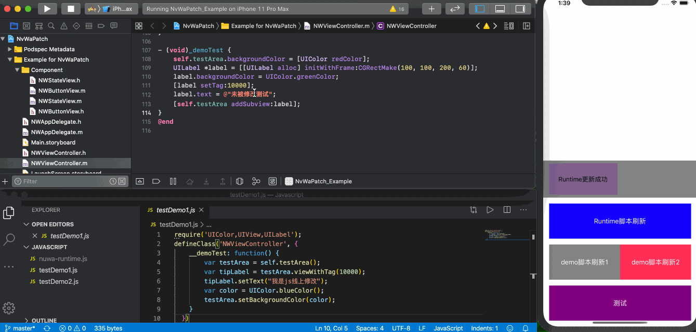

# NvWaPatch   
 
##  技术价值  

1.动态替换原生代码，线上修复bug。  

2.动态增加原生模块，线上增加新功能。  

3.可与其他跨平台框架结合，增强动态能力。   

## 关于审核   

**1.特定类名检查**:主要是针对一些公众比较熟知的热修复开源库比如JSPatch。   

**2.特定API检查**：苹果对消息转发、方法替换API进行检查，这些机制都属于系统API，所以苹果比较容易校验。 

**3.实现原理不同**：女娲热修复机制脚本DSL与JSPatch保持一致（后续准备模块化，容易扩展）；而底层设计与JSPatch完全不同，未使用消息转发机制，而是直接替换调用接口地址，绕过苹果消息转发机制，那么苹果在Runtime机制下则很难察觉。   

**4.底层架构设计**：（JSEngine+DSLParse+Mehtod+HookEngine）重新设计，不在苹果特定检查类名列表中。  

**5.审核案例**：业界有企业使用该机制实现的热修复供企业内部使用，审核可用，故不开源。    

## 效果演示    

**1.演示步骤**     

（1）安装静态资源服务器：http-server。  

（2）终端进度到项目根目录(Example)下， cd Javascript，然后运行http-server。  

**2.效果演示** 

**`备注`：**

（1）因`目前只是将主链路打通，还有很多数据结构、方法并未丰富完善，支持能力还很弱`，可运行提供的Demo即可。  

（2）未开源，`项目原始源码地址`：https://bitbucket.org/li_yizhen/nuwapatch/src/master/   

## Author  

李义真, scut.liyizhen.software@gmail.com  

## License  

NvWaPatch is available under the MIT license. See the LICENSE file for more info.  
